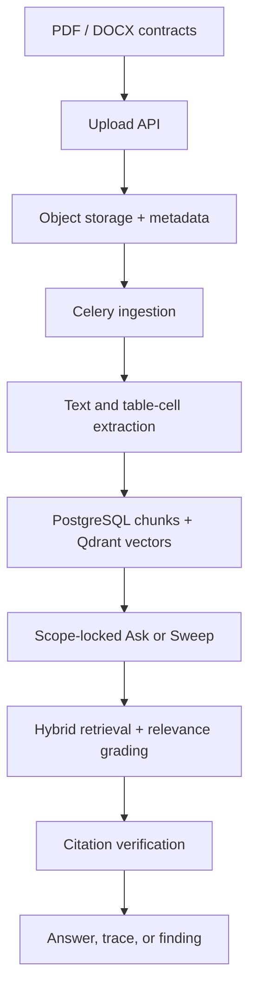

# ClauseGuard

**Contract Intelligence for evidence-grounded contract review.**

ClauseGuard is a tenant-isolated contract intelligence system for uploading contracts, asking scoped questions, and running rule-directed portfolio sweeps. It turns PDF and DOCX agreements into searchable contract evidence, then answers only when it can verify in-scope citations.

## Why Contract Intelligence

Generic document chat treats contracts as loose text. ClauseGuard models contracts as tenant-bound families, documents, versions, roles, business units, policy rules, sweeps, findings, citations, and judgment traces.

That structure matters: retrieval is locked to a selected document or contract family before generation starts, family questions use only in-force indexed documents, and returned citations are checked against stored source chunks before an answer is marked `answered`. When evidence is missing, out of scope, or not verifiable, the API returns `needs_review` or records an `unchecked` finding instead of manufacturing a compliance verdict.

## How It Works



## Key Capabilities

- **Scoped Ask** for document, family, and portfolio contexts, with tenant and business-unit isolation enforced in the resolver, retrieval filters, and final citation checks.
- **Contract-family context** that groups related documents and filters family questions to in-force, indexed or partially indexed documents.
- **Evidence-grounded answers** using lexical search, optional OpenAI query planning, Qdrant dense retrieval, reciprocal-rank fusion, relevance grading, and citation verification.
- **PDF/DOCX ingestion** that extracts prose plus explicit table-cell evidence with page, row, and column metadata.
- **Policy sweeps** that evaluate active rules across active contract families and create reviewable findings; unsupported verdicts remain `unchecked`.
- **Operational controls** for users, tenants, rules, pipeline stages, logs, audit events, traces, document force status, sweeps, and finding disposition.

## Tech Stack

| Layer | Implemented technologies |
| --- | --- |
| API | Python 3.11+, FastAPI, Pydantic settings, JWT bearer auth |
| Domain and persistence | SQLAlchemy, Alembic, PostgreSQL |
| Ingestion and jobs | Celery, RabbitMQ broker, Redis result backend |
| Retrieval | Qdrant, OpenAI embeddings, lexical SQL search, reciprocal-rank fusion |
| Document extraction | pdfplumber, pypdf, python-docx |
| Object storage | Local filesystem adapter or S3-compatible storage via boto3 |
| Web app | React 19, TypeScript, Vite, Tailwind CSS, lucide-react |
| Tests and tooling | pytest, httpx, ruff |

## Repository Structure

```text
src/
  app/api/        FastAPI service and HTTP schemas
  app/worker/     Celery app, ingestion tasks, sweep tasks
  app/web/        React/Vite frontend
  packages/core/  Domain entities, settings, retrieval, ingestion, storage
  migrations/     Alembic schema migrations
  deploy/         Docker Compose for local PostgreSQL
  tests/          Scope, configuration, and infrastructure tests
```

## Quick Start

Run commands from `src` unless noted.

```powershell
python -m venv .venv
.\.venv\Scripts\python -m pip install -e ".[dev]"
Copy-Item .env.example .env
Copy-Item deploy\.env.example deploy\.env
docker compose --env-file deploy\.env -f deploy\compose.yaml up -d
.\.venv\Scripts\python -m uvicorn clauseguard_api.main:app --app-dir app/api --reload
```

In another terminal, start the worker:

```powershell
cd src
.\.venv\Scripts\celery -A clauseguard_worker.celery_app:celery_app worker --beat --app-dir app/worker
```

In another terminal, start the web app:

```powershell
cd src\app\web
npm install
npm run dev
```

The Vite dev server proxies `/v1` and `/health` to `http://127.0.0.1:8000`.

For ingestion and answered questions, configure the values in `src/.env`: `OPENAI_API_KEY`, `QDRANT_URL`, `RABBITMQ_URL`, `REDIS_URL`, object storage settings, and either a bootstrap tenant admin or super-admin account. The bundled Compose file starts PostgreSQL only; Qdrant, RabbitMQ, and Redis are expected to already be reachable at the configured endpoints.

## Verification Behavior

ClauseGuard stores every Ask result as a judgment trace. The trace records scope lock, pipeline configuration, retrieval rounds, relevance grading, and citation verification. The system will not mark an answer as verified unless at least one citation quote is found in an allowed source chunk for the selected scope.

Portfolio Ask reads the latest completed sweep when available. If no completed sweep exists, it queues a normal sweep and returns the queued sweep id.
